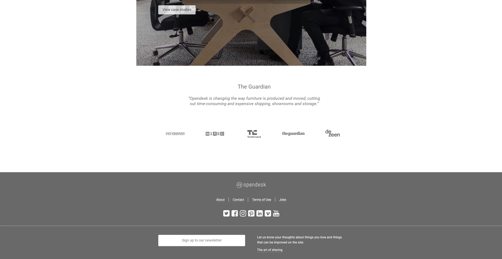

## Experience with UI Frameworks

Well before using UI framework I think UI framework will be much easier to learn since it is a framework, that will have most of things done for you. Yes, that is true. After using Bootstrap 5, it saves lots of time. It has pre-designed components that we just need to insert the class in the div. Then boom, it does the styling for you. But it is not easy to learn bootstrap 5. It is like a new programming language. The first few assignments that required me to use Bootstrap 5 for my software engineer class gave me a hard time and took me a long time. I have to look up the documentation and try to understand how to use it. It is not that easy to learn because there are so many things to learn. For example, there are so many different classes and different ways to use it.

## Is it worth it to learn UI Frameworks?

So it might be really hard to learn at first but it is worth it. It saves lots of time. For example, if you want to create a navbar. You just need to insert the class "navbar" in the div and then insert the class "navbar-brand" in the div that you want to be the brand of either your logo or the brand name. Then insert the class "navbar-nav" in the div that you want to be the nav. Then insert the class "nav-item" in the div that you want to be the item. If you want you can insert the class "nav-link" in the div if you want to add a link in the navbar. It is really simple, right? If you were to do it with just CSS and HTML then it take you longer to set up the navbar and style it. The website made out of with or without UI framework doesn't have much difference. It is just that the UI framework saves you lots of time.

For example the screenshots of the website above. Can you tell if the webpage is created with UI framework or without UI framework? Probably not. This website is created with a UI framework. It has a navbar, image, footer, and card. Which are things that websites normally have. Since you can get the same result with or without the UI framework. Then why not choose the way that can save you lots of time? So I believe it is worth it to learn UI framework even though it is hard to learn at first. It will save you lots of time in the future

