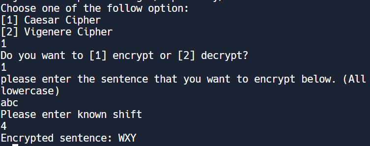
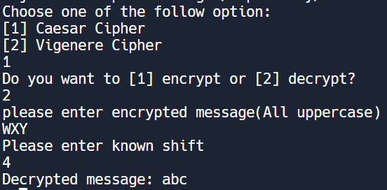
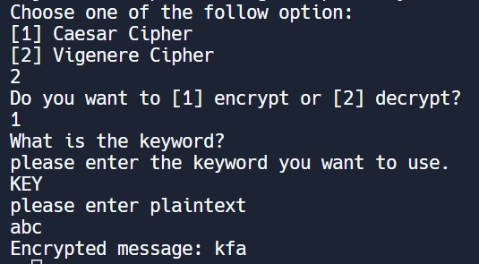
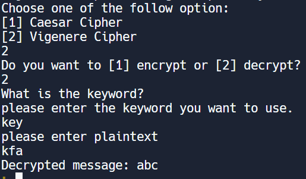

  
  
 

This is a encryption and decryption program. There are two type of cipher in this program. The first one is Caesar cipher. Which is a simple method of encoding messages. To encrypt you just need to set a password(an integer and represent number of slots shift to the right). For example, you encrypt "a" with password "3" then enconded result is "d". To decrypt would need to enter the encrypted message with the password(this time shift left). Enter "d" with password "3" you will get the original message you have entered and in this case is "a". To encrypt you don't have to shift right. You can also shift left but just have to make decrpytion shift the opposite way of encryptuin.

  
  
 

The second type of cipher is Vigenere cipher. Which is another shift encoder. To encrypt you need to add the value(position of letter in alphabet -1 because Computer science is 0 based) of the letter you want to encode with the letter of the key you have set up. For example, encrypt "abc" with the key "key". 
Process: (a=0, b=1, c=2, k=10, e=4, y= 24) first letter "a": 0+10=10 which become "k" second letter"b": 1+4=5 which become is "f" last letter "c" = 2+24=26 but it is equal 26 so you need to take the modulo of 26 (26%26) which is 0 and become "a". 
Result: "kfa" For decryption, it is the opposite of encryption. You subctract encrypted letter value with key value.

This program was an assignment for AP coomputer science A. This is the first time I was introduced to some kind of encrypytion and decryption. I have took me a long time to finish that assignment. It is not the concept is hard. It is having it bit trouble with the scanner skipping lines. So the program could not receive the input needed to perfrom encryption and decryption.

Source: <a href="https://replit.com/@yc2003/Final-cipher1"><i class="large github icon "></i>Link to my source code</a>
