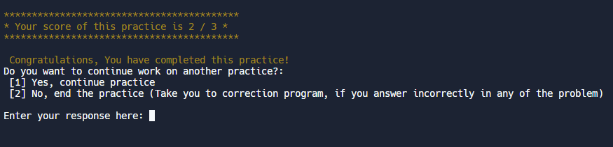

   
 

                       

  When the program run it will ask user decide how many and what type of problem the user want to practice.

  
  
 

  When the program run it will ask user decide how many and what type of problem the user want to practice.

  

  When the program run it will ask user decide how many and what type of problem the user want to practice.

  
  

  When the program run it will ask user decide how many and what type of problem the user want to practice.

