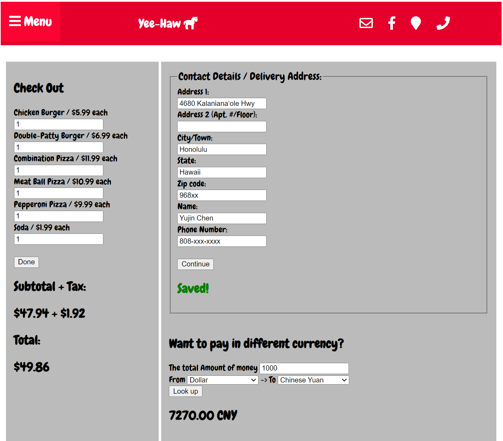

  
  

This website is created for the Intro to Computer Science class 3rd quarter final project. This is a collaborative project. I worked on this with my friend Yoon in high school. There are a total of three web pages: About Us, Menu, and Checkout page. I don't know why but for some reason during that time, my friend and I were a little crazy， having "yee-haw" as our mantra. That is why we name the website "yee-haw" The information on the About page is all made up. The About Us page doesn't have any other function other than the icons in headers. There is a header on every page. 

Next, the menu page. The menu has the name, price, and image of each item on the menu. There is a drop-down under every item's image. You can click on it, then it will show you the description of the item with its calories. Last page, the checkout menu. On the left side, the user can type or use the button on the input box to order how many it wants for each dish or item. After the user is done, it can click on the done button then it will show the subtotal, tax, and total. The right upper section is for the user to enter their contact information. The right bottom section is to help users calculate the money if use a different currency. The data currency exchange rate is straight from an API. 

This website has met the requirement to receive the full score. We did try to add more to the website but the time is up. On the check out page, you can enter a negative number when ordering food. The icons located on the right side of the header are not finished as well. This is the first website I have created. This experience is valuable even though the website is not perfect.

Source: <a href="https://replit.com/@yc2003/Q3Final-Project#index.html"><i class="large github icon "></i>Link to my source code</a>
